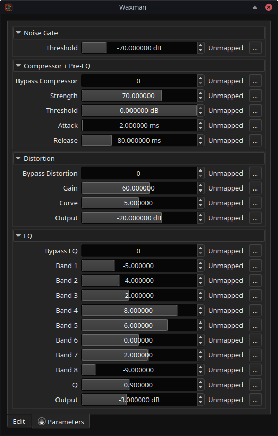

# Waxman

Let's rock, man!

## Description

Waxman is a virtual **guitar pre-amp** and tone-stack comprising of a
**compressor**, **distortion** and **equalizer** stage. It is a multi-format,
cross-platform audio effect plugin, which can be loaded in to any DAW, which
supports one of the plugin formats listed below.

The plugin was created to emulate the kind of sounds you can get from a **Tom
Scholz Rockman**, which were a series of well-known headphone practice amps
from the 80s. These were also one of the first guitar amp simulators and were
used on countless hit records in that decade and in the nineties. The plugin
does not simulate the exact circuit of a Rockman but mimics the general chain
of tone-shaping components the original had.

It does not include the chorus and echo the original had, since these effects
can be easily added with other plugins (see the audio examples below) but it
adds a noise gate with adjustable threshold after the input, since that is often
useful for distortion sounds.

The plugin can be used to create sparkly clean sounds, crunchy overdrive tones
and mild to medium-heavy distortion. Think 80s pop/hairmetal rather modern
hi-gain mayhem. The eight-band EQ allows to shape the sound drastically, so it
can better fit in a mix. In fact, the Rockman is famous for its compressed,
mid-boosted tones, that may sound strange on their own but can punch through
a busy mix or lend themselves to layering.

**Note:** This software is still in *Beta Status* and some fine-tuning of its
tone-shaping blocks may still occur. Until the first stable release comes out,
no guarantee is made that plugin presets stay compatible with the next version.
So, for now, I suggest you take screenshots of your favourite settings!

### What does the name "Waxman" stand for?

I don't usually like explaining puns, but since this name can have many
interpretations, I feel that in this case I should:

The name is, of course, a play on "Rockman", which itself was a play on
"Walkman" (it came with headphones and looked similar to a portable cassette
player).

* "Hard as a rock" (hardware) vs "Soft as wax" (software)
* Wax can be molded and the plugin has many parameters to shape the sound,
  where as Rockman has very few settings, i.e. the sound is set in stone
  (rock).
* You can use wax to make an imprint of things to create an imperfect copy.
  Waxman can make imperfect copies of the kind of sounds you can get out of a
  Rockman.
* Using Waxman you can *wax lyrically* on your guitar.
* It sounds similar to "Axeman" (i.e. something to use with your "axe" =
  "guitar"), but that name could conjure up unpleasant associations with horror
  films etc.

## Audio Demos

* [Dist 1 preset](./audio/waxman-dist-1.ogg) (Ogg Vorbis, Yamaha Revstar 520, P90 Bridge)
* [Clean 3 preset](./audio/waxman-clean-3.ogg) (Ogg Vorbis, Yamaha Revstar 520, P90 Bridge + Neck)
* [Fuzzy Hairy preset](./audio/waxman-fuzzy.ogg) (Ogg Vorbis, Yamaha Revstar 520, P90 Neck)
* [Sweet Lead preset](./audio/waxman-sweet-lead.ogg) (Ogg Vorbis, Yamaha Revstar 520, P90 Neck)

**Note:** all audio demos use additional [Chorus], [Delay] and [Reverb]
plugins. Here are the [custom LV2 presets](./audio/chorus-delay-lv2-presets.zip)
used with these plugins (other presets used are built-in factory presets).

[Chorus]: https://chrisarndt.de/plugins/cchorus
[Delay]: https://chrisarndt.de/plugins/stereo-cross-delay
[Reverb]: https://chrisarndt.de/plugins/dfzitarev1

## Screenshot

## Formats

This plugin is available in the following plug-in formats by default:

* [CLAP] (`de.chrisarndt.waxman`)
* [LV2] (`https://chrisarndt.de/plugins/waxman`)
* [VST3][vst] (`waxman.vst3`)

The following formats are not built by default, but can be enabled when
compiling (see ["Compiling"](#compiling)):

* [LADSPA] (`waxman-ladspa.so`)
* [VST2][vst] (`waxman-vst.so`)

The plugin depends on the host to provide a generic UI to control parameters.

## Compiling

Make sure you have installed the required build tools and libraries (see
section "Prerequisites" below) and then clone this repository (including
sub-modules) and simply run `make` in the project's root directory:

    $ git clone --recursive https://github.com/SpotlightKid/waxman.git
    $ cd waxman
    $ make

To enable building additional plugin formats, which are not enabled by default
(LADSPA, VST2), pass `BUILD_LADSPA=true` resp. `BUILD_VST2=true` to make. For
example:

    make BUILD_VST2=true

The same settings must be passed to `make install` to also install optional
plugin formats.

## Installation

To install all plugin formats to their appropriate system-wide location, run
the following command (root privileges may be required):

    make install

The makefiles support the usual `PREFIX` and `DESTDIR` variables to change the
installation prefix and set an installation root directory (default: empty).
`PREFIX` defaults to `/usr/local`, but on macOS and Windows it is not used,
since the system-wide installation directories for plugins are fixed.

Use make's `-n` option to see where the plugins would be installed without
actually installing them.

You can also set the installation directory for each plugin format with a
dedicated makefile variable.

* CLAP: `CLAP_DIR` (`<prefix>/lib/clap`)
* LADSPA: `LADSPA_DIR` (`<prefix>/lib/ladspa`)
* LV2: `LV2_DIR` (`<prefix>/lib/lv2`)
* VST2: `VST2_DIR` (`<prefix>/lib/vst`)
* VST3: `VST3_DIR` (`<prefix>/lib/vst3`)

Example:

    make DESTDIR=/tmp/build-root BUILD_VST2=true VST2_DIR=/usr/lib/lxvst install

To install the plugins only for your current user account, run
`make install-user`.

Again, you can also set the installation directory for each plugin format with
a dedicated makefile variable.

* CLAP: `USER_CLAP_DIR` (`$HOME/.clap`)
* LADSPA: `USER_LADSPA_DIR` (`$HOME/.ladspa`)
* LV2: `USER_LV2_DIR` (`$HOME/.lv2`)
* VST2: `USER_VST2_DIR` (`$HOME/.vst`)
* VST3: `USER_VST3_DIR` (`$HOME/.vst3`)

*Note: The given default values for all of the above listed makefile
variables differ depending on the target OS.*

## Prerequisites

* The GCC C++ compiler, library and the usual associated software build tools
  (`make`, etc.).

  Debian / Ubuntu users should install the `build-essential` package
  to get these, Arch users the `base-devel` meta package.

* `patch`

* [pkgconf]

* The [faustdoctor] pre-processor and [FAUST] (optional)

The [CLAP], [LV2], [LADSPA], [VST2][vst] (Xaymar VST2SDK) and [VST3][vst]
headers are included in the [DPF] framework, which is integrated as a Git
sub-module. These need not be installed separately to build the software in
the respective plug-in formats.

`faustdoctor` and FAUST are only needed to re-generate C++ source and header files
if the FAUST DSP source files in the `faust` directory are changed.

## Author

This software was created by *Chris Arndt*.

## License

This plugin is released under the *MIT* license. Please see
the [LICENSE.md](./LICENSE.md) file for details.

## Acknowledgements

The DSP code is generated from the FAUST sources via the [faustdoctor]
post-processor.

The project is built using the DISTRHO Plugin Framework ([DPF]) and was created
from the [dpf-faust-project-template] using [copier].

[clap]: https://cleveraudio.org/
[dpf-faust-project-template]: https://github.com/SpotlightKid/dpf-faust-project-template
[copier]: https://copier.readthedocs.io/en/stable/
[dpf]: https://github.com/DISTRHO/DPF
[faust]: https://faust.grame.fr/
[faustdoctor]: https://github.com/SpotlightKid/faustdoctor
[ladspa]: https://www.ladspa.org/
[lv2]: https://lv2plug.in/
[pkgconf]: https://github.com/pkgconf/pkgconf
[vst]: https://en.wikipedia.org/wiki/Virtual_Studio_Technology
